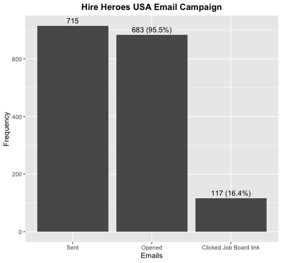

# HHUSA Marketing and Development analysis

Questions answered after data cleaning, exploration and analysis:

<ul>
<li><i>Is there a geographic location within the US that most of our individual donors come
from? Are there areas in the country we don't see any donors from? Do our social media
  posts or fundraisers calling for donations hit these areas with little to no donors?</i></li>
  
  Most individual donations are coming from Georgia, Texas, California and New York.
There is at least one donor from every state.
The Plains, Rocky Mountain, Southwest and New England regions have the least amount of individual donations from both a volume and dollar amount perspective.
The Great Lakes and Far West regions have several individual donors but the donation amount per individual is lower than other regions. 

Most fundraising and social media dollars come from the Mideast and the Southeast. NY alone represents 20% of fundraising and social media dollars and GA represents 19%. 
Fundraisers/social media posts are not hitting areas with little to no donors. 

Recommendation: Target states with low ratios of individual donors to veterans

  <li><i>Do email campaigns have any effect on individual donations?</i></li>
  
   Yes, email campaigns have a slight impact on individual donations, accounting for 7.5% of overall individual donation amounts.

<li><i>Do email campaigns have any effect on job seekers creating profiles on the Hire Heroes
  USA Job Board?</i></li>
  
  
  
   For every 6-7 emails sent, 1 job seeker creates a profile on the Hire Heroes USA Job Board.

<li><i>Is there a relationship between certain days of the week, times in the day, or months, or
  time of year and when employers and job seekers create accounts?</i></li>
  
 Both job seekers and employers tend to create accounts in the middle of the week (Tuesdays, Wednesdays, Thursdays), and much less so on Saturdays and Sundays. However, employers also create as many accounts on Mondays.
There is an increase in account creations from 11 UTC (7AM EST), peaking at 18 UTC (2PM EST).
Most account creations occur in August; the least in December.
While the 20th of each month resulted in the most job seeker account creations, it marked the least frequent day for employer profile creations.
Most employer profile creations occur on the 1st of the month.

  </ul>
